# Week 3 — Password Cracking Lab (NetworkWalks Academy)

**Student:** Noman Atiq | Batch B083
**Instructor:** Waqas Karim (CCIE)

## Objective

This week's task was to crack the password on three locked PDF files (`My Locked PDF1.pdf`, `My Locked PDF2.pdf`, `My Locked PDF3.pdf`) using two different approaches:

- **PM1:** John the Ripper — both the `john` CLI (on Kali Linux) and the Johnny GUI (on Windows)
- **PM2:** Networkwalks' own browser-based Hash Calculator + Password Cracker tools

The idea was to see the same dictionary-attack concept implemented three different ways and confirm all three land on the same password for each file.

## Environment

| Item | Detail |
|---|---|
| Lab VM | VirtualBox — Kali Linux |
| VM network | NAT Network "NatNetwork", static IP 10.0.0.2/24, gateway 10.0.0.1 |
| Wordlist | `/usr/share/wordlists/rockyou.txt` (Kali built-in) |
| PM1 (CLI) | John the Ripper (pre-installed on Kali) |
| PM1 (GUI) | Johnny + JTR jumbo build (Windows) |
| PM2 | [Networkwalks Hash Calculator](https://networkwalks.com/hash-calculator/) + [Password Cracker](https://networkwalks.com/password-cracker/) |
| Hash extraction (Windows side) | [Online Hash Crack — PDF Hash Extractor](https://www.onlinehashcrack.com/tools-pdf-hash-extractor.php) |

Before touching the actual lab, I had to fix my VirtualBox Kali VM — it kept crashing and hanging  so I removed it then reextracted it but this time instead of HDD I used SSD and it solved the problem. After logging in another problem arose, it had lost its network connection. `eth0` had link/carrier but no IP assigned at all, and `nmcli connection up` was failing with "IP configuration could not be reserved." Turned out `ipv4.dad-timeout` had reset to its default instead of staying at `0` (Duplicate Address Detection stalls out on this NAT Network setup). Reapplied:

```bash
sudo nmcli connection modify "Wired connection 1" ipv4.dad-timeout 0
sudo nmcli connection up "Wired connection 1"
```

That brought `eth0` back up with 10.0.0.2/24, gateway and internet both reachable, and the rest of the lab went smoothly from there.

## PM1 — Password Cracking with JTR

### Method 1: John the Ripper CLI (Kali)

For each PDF, extracted the hash with `pdf2john` and ran a dictionary attack with rockyou.txt:

```bash
pdf2john "My Locked PDF1.pdf" > hash1.txt
john --wordlist=/usr/share/wordlists/rockyou.txt --format=PDF hash1.txt
```

Repeated the same for PDF2 and PDF3. All three cracked in seconds:

| File | Hash (truncated) | Password |
|---|---|---|
| My Locked PDF1.pdf | `$pdf$4*4*128*-1028*1*16*ca7f72f1...` | `good-luck` |
| My Locked PDF2.pdf | `$pdf$4*4*128*-1028*1*16*0853f2cd...` | `password1` |
| My Locked PDF3.pdf | `$pdf$4*4*128*-1028*1*16*34eb542e...` | `1qaz2wsx` |

**Evidence:**

Terminal transcript (all three PDFs cracked via `pdf2john` + `john`):


PDF1 opened with cracked password, flag captured:


PDF2 opened with cracked password, flag captured:
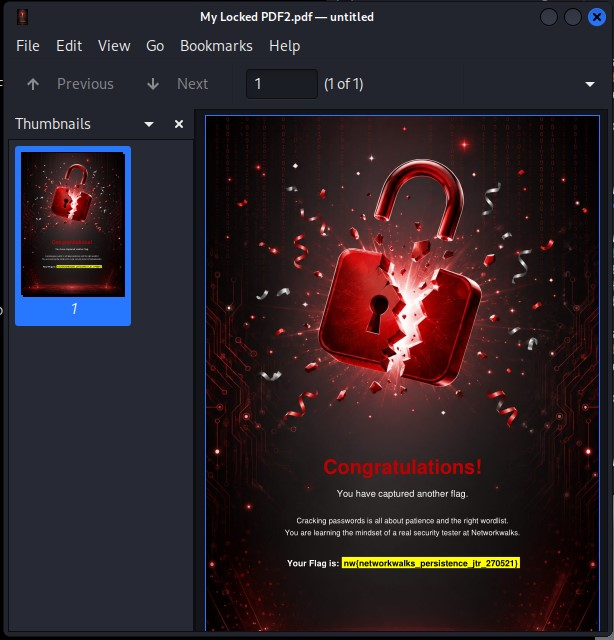

PDF3 opened with cracked password, flag captured:
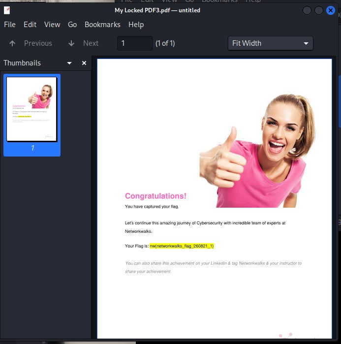

### Method 2: Johnny GUI (Windows)

To match the task sheet exactly, I extracted the hash separately using the online `onlinehashcrack.com` PDF hash extractor (rather than reusing the Kali-generated hash), saved each as `hash1.txt` / `hash2.txt` / `hash3.txt`, and loaded them into Johnny (pointed at `john.exe` from the JTR jumbo Windows build).

Johnny confirmed the exact same three passwords, cracked at 100% (3/3):

| User | Password | Format |
|---|---|---|
| ? | `good-luck` | PDF |
| ? | `password1` | PDF |
| ? | `1qaz2wsx` | PDF |

**Evidence:**

Hash extracted via onlinehashcrack.com's PDF Hash Extractor for each PDF:
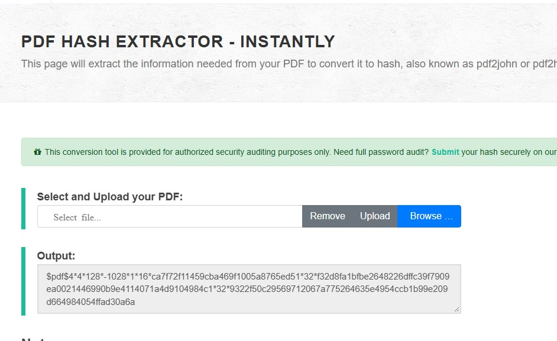
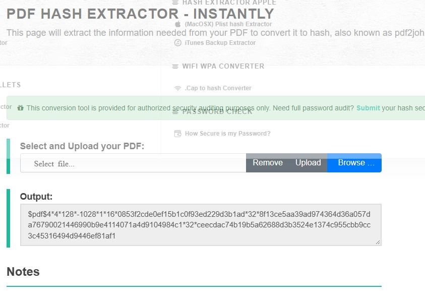
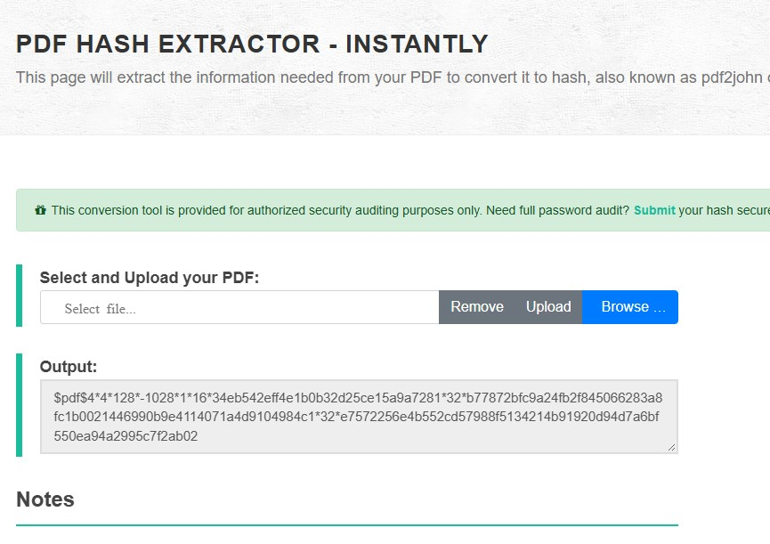

Johnny results table (3/3 cracked):


PDF1 opened with cracked password, flag captured:


PDF2 opened with cracked password, flag captured:
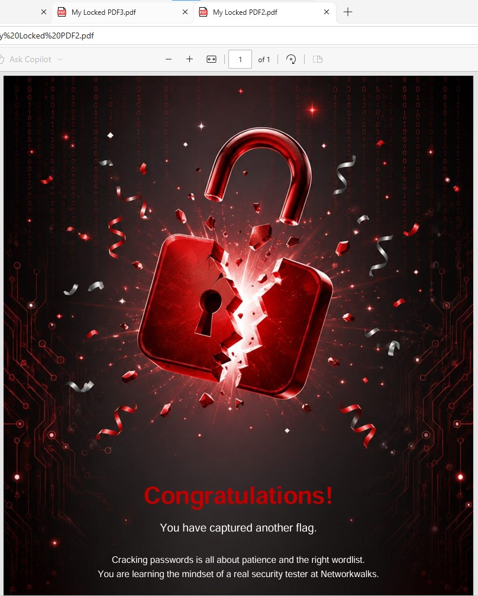

PDF3 opened with cracked password, flag captured:
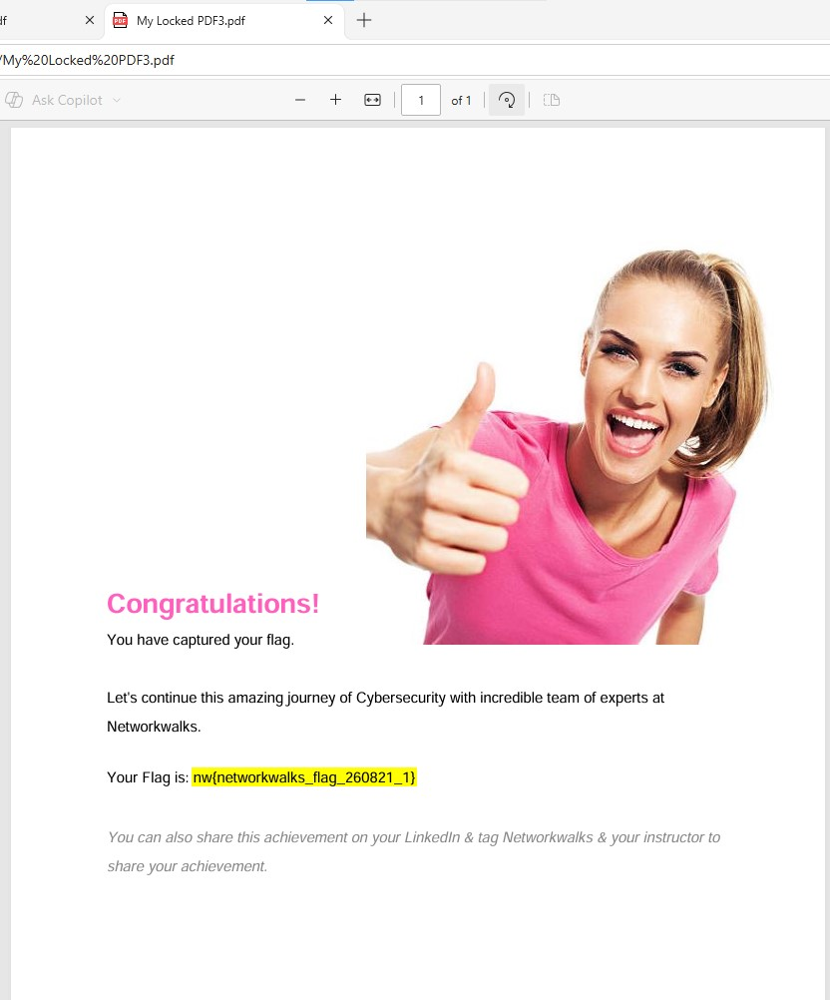

## PM2 — Password Cracking with Networkwalks Tools

Same three PDFs, this time entirely through the browser:

1. Uploaded each PDF to the **Hash Calculator** → got the `$pdf$...` hash
2. Pasted the hash into the **Password Cracker** → ran the built-in wordlist attack

PDF1's password (`good-luck`) wasn't in the Password Cracker's built-in wordlist (100 passwords), so I had to upload a custom wordlist for that one. I first tried uploading rockyou.txt (the same one that cracked it instantly via John CLI), but the tool couldn't handle it — seems to cap out somewhere around 1,500 words. Had to trim down to a smaller custom list containing the actual password before it would crack.

| File | Hash Calculator output | Password Cracker result |
|---|---|---|
| My Locked PDF1.pdf | `$pdf$4*4*128*-1028*1*16*ca7f72f1...` | `good-luck` |
| My Locked PDF2.pdf | `$pdf$4*4*128*-1028*1*16*0853f2cd...` | `password1` |
| My Locked PDF3.pdf | `$pdf$4*4*128*-1028*1*16*34eb542e...` | `1qaz2wsx` |

Same results as PM1 across the board — good confirmation that the hash extraction and dictionary attack are consistent regardless of tool.

**Evidence:**

PDF1 — hash extracted, then cracked:
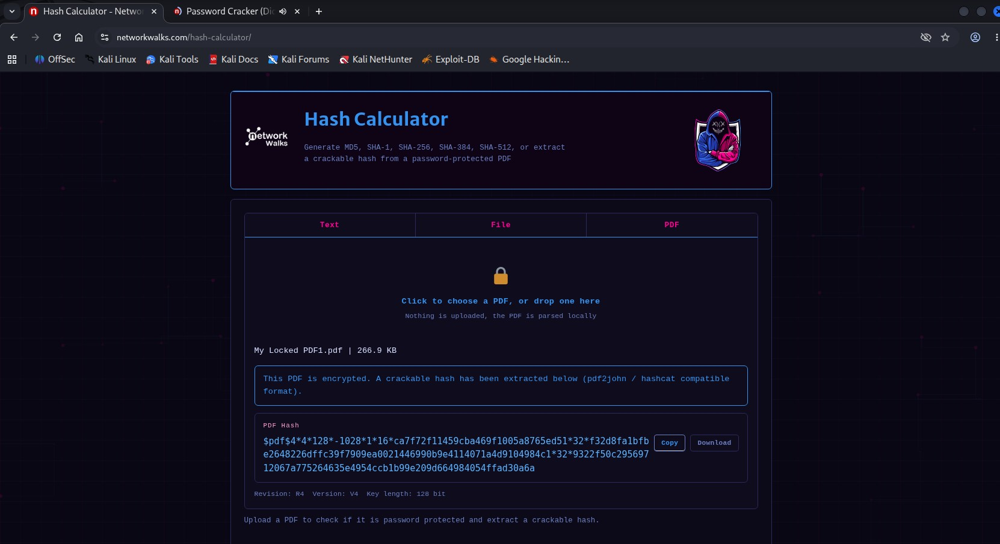
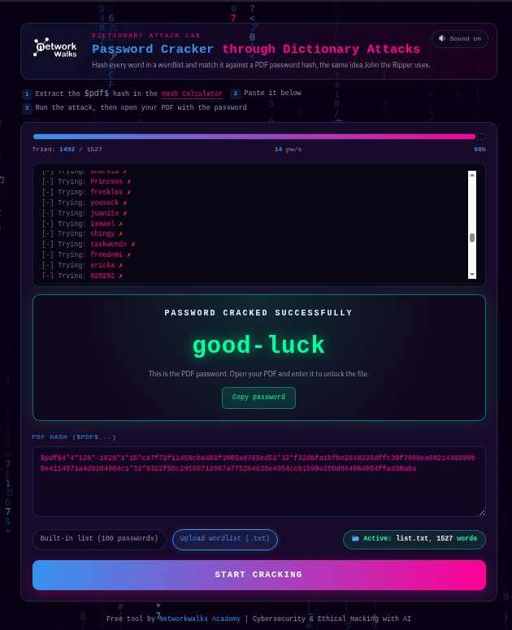

PDF2 — hash extracted, then cracked:
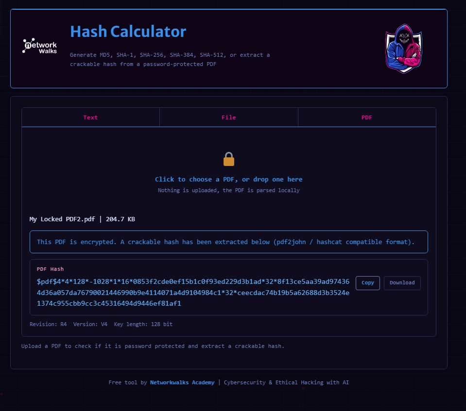
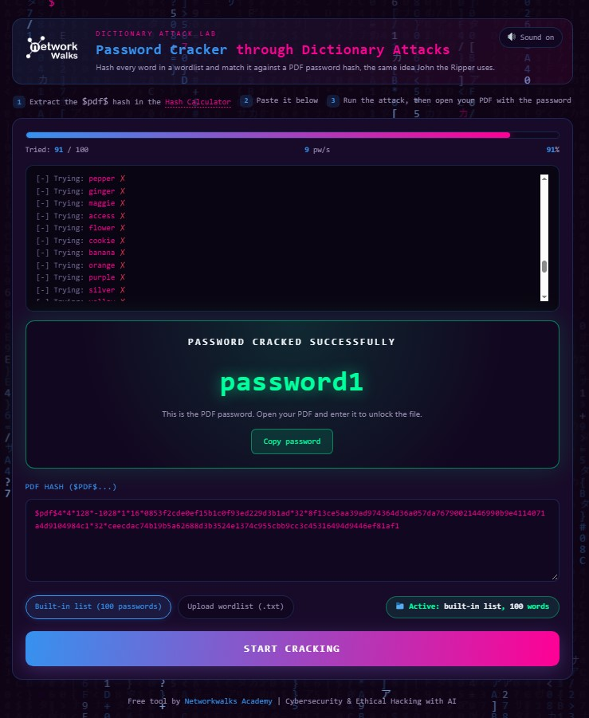

PDF3 — hash extracted, then cracked:
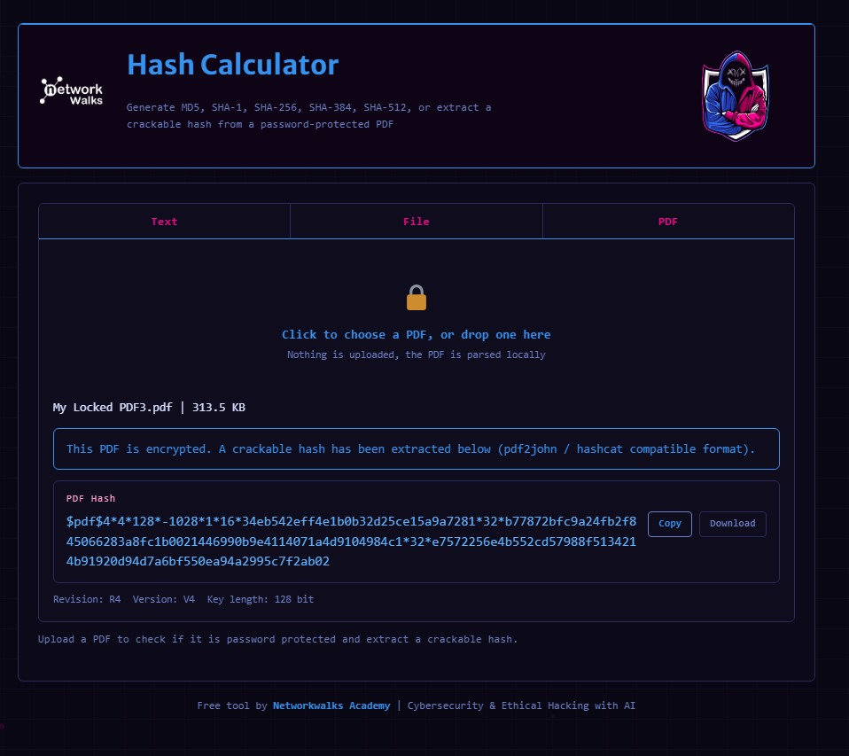
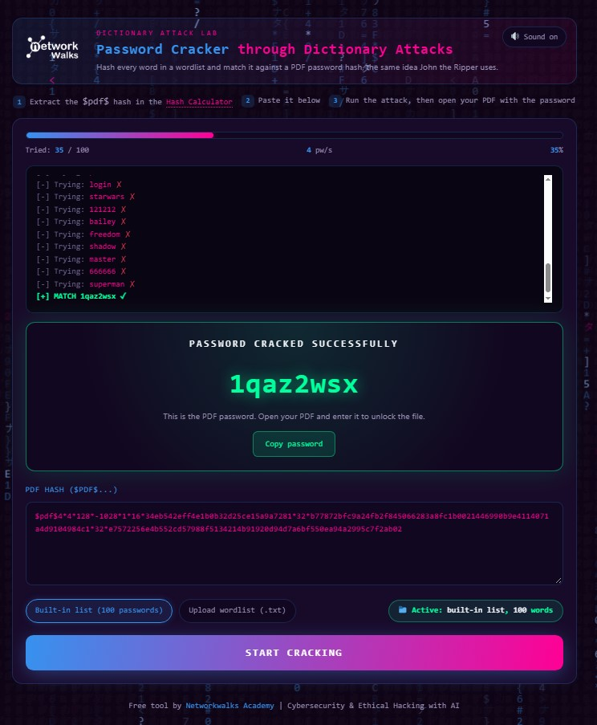

## Flags Captured

- PDF1: `nw{cybersecurity_flag_captured_2608}`
- PDF2: `nw{networkwalks_persistence_jtr_270521}`
- PDF3: `nw{networkwalks_flag_260821_1}`

## Key Takeaways

- `pdf2john` (CLI) and the online PDF hash extractor produce hashes that lead to identical cracked passwords — cross-checked across three independent tools (John CLI, Johnny GUI, Networkwalks Password Cracker) and all three agreed on every file.
- All three passwords here were weak/common enough for a small wordlist to crack almost instantly, which is really the point of the lab: short or dictionary-based passwords fall fast, regardless of which cracking tool is used.
- Persistent lab environment issues (like the VirtualBox network drop) are worth documenting alongside the actual task — they're as much a part of the learning as the cracking itself.

## Evidence Files

All evidence is in the repo root alongside this README:

```
john-the-ripper terminal.jpg
john-the-ripper1.jpg
john-the-ripper2.jpg
john-the-ripper3.jpg
johnny GUI.jpg
johnny1.jpg
johnny2.jpg
johnny3.jpg
hashext1.jpg
hashext2.jpg
hashext3.jpg
networkwalkshash1.jpg
networkwalkshash2.jpg
networkwalkshash3.jpg
cracked1.jpg
cracked2.jpg
cracked3.jpg
hash1.txt
hash2.txt
hash3.txt
```

-End-
